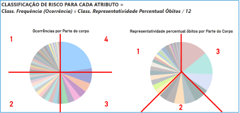
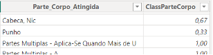
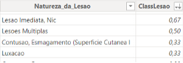
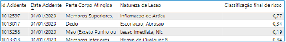
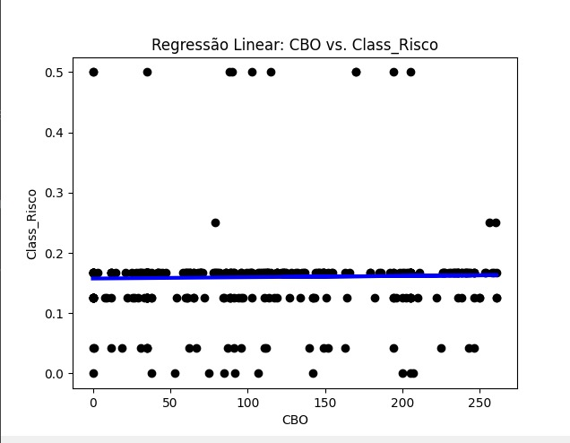

## 4.2. Classificação de risco 

A base de dados não vem com classificação de risco prévia. Antes de treinarmos o modelo a classificar risco, precisamos estabelecer, portanto, a nossa definição de risco, e classificar nossa base de treinamento de acordo com tal. 

A classificação para treinamento será baseada nos acidentes que já aconteceram, assim, utilizamos os seguintes atributos: “parte do corpo afetada”, “natureza da lesão” e “Ocorrência de óbito”. Consultando o histórico de acidentes, podemos relacionar quais partes do corpo e tipos de lesão provocam mais óbitos e a partir desta referência atribuir uma nota de risco para cada registro. Dessa forma, conseguiremos treinar nosso modelo com base no que já aconteceu, para que ele nos forneça uma equação que preveja riscos futuros baseados em outros atributos que não dependam de fatos passados, como sexo, ocupação, idade, etc. 

Seguindo este raciocínio, a classificação da base de treinamento é feita, automaticamente, de acordo com o seguinte algorítmo: 

Para cada atributo (parte do corpo, natureza da lesão), ranquear seus valores por frequência (número de ocorrências na base), e representatividade percentual de óbitos na base (porcentagem de óbitos com relação ao total de óbitos da base). 

Uma nota é atribuída para cada faixa do ranking. Notas de 1 a 4 para frequência (maior nota para valores mais frequentes) e de 0 a 3 para representatividade de óbito (maior nota para valores com mais óbitos). 

A nota de risco para o atributo é obtida pela multiplicação das notas de faixa de ranking, divida por 12, para que os resultados fiquem entre 0 e 1. 

    
 Figura 2 – Esquema de ranqueamento e classificação de risco dos atributos relevantes 

  
  
Fonte: Autores, 2024.

    
 Figura 3 – Exemplo de atributos classificados após o ranqueamento

  
  
  
Fonte: Autores, 2024

Finalmente, a nota final de classificação para cada linha da base de treinamento é dada pela média das notas atribuídas a cada atributo da linha.

    
 Figura 4 – Exemplo ilustrativo acidentes da base final classificados

  
  
Fonte: Autores, 2024

Uma vez classificada, a base pode ser utilizada para treinamento do algoritmo com base no sexo, ocupação, idade, empregador e localidade.

## 4.3. Treinamento de máquina
Após a definição e classificação inicial dos dados de risco com base nos históricos de acidentes de trabalho, como detalhado anteriormente, essa próxima etapa do nosso estudo envolve o emprego de técnicas de aprendizado de máquina para desenvolver modelos preditivos.

### 4.3.1. Regressão Linear
A regressão linear é uma técnica estatística que modela a relação entre variáveis dependentes e independentes. É ideal para analisar como a classificação ocupacional (CBO) impacta o risco de acidentes de trabalho, oferecendo uma maneira quantitativa de avaliar a influência de cada categoria ocupacional na segurança do trabalho.
Utilizando a biblioteca sqlalchemy, extraímos dados da tabela ft_rank e transformamos a coluna CBO em numérico com o LabelEncoder para uso no nosso modelo de regressão linear. Dividimos os dados em 67% para treino e 33% para teste. Após treinamento, aplicamos o modelo aos dados de teste e visualizamos os resultados através do gráfico abaixo, ilustrando a linha de regressão sobre os dados testados.

    
 Figura 5 – Regressão Linear

  
  
Fonte: Autores, 2024

### 4.3.2. Árvore de Regressão
Diferente da regressão linear, a árvore de regressão tem a capacidade de revelar interações complexas e não-lineares entre variáveis. Esse modelo detalha como diferentes categorias ocupacionais (CBO) impactam o risco de acidentes de trabalho, permitindo uma análise mais granular e insights específicos para intervenções em segurança.
No processo, acessamos dados da tabela ft_rank via sqlalchemy, restringindo a consulta às primeiras mil linhas para eficiência. A transformação da coluna CBO em valores numéricos, realizada com LabelEncoder, facilitou sua inclusão como variável explicativa. Após segmentar os dados para treino e teste, a árvore de regressão foi treinada e visualizada usando matplotlib, demonstrando claramente a contribuição de cada categoria ocupacional ao risco observado.

    
 Figura 6 – Árvore de Regressão

  
  
Fonte: Autores, 2024

### 4.3.3. Árvore de Classificação
Iniciamos o desenvolvimento do modelo de árvore de classificação para analisar os riscos em acidentes de trabalho, utilizando a coluna Class_Risco que compila valores contínuos das médias de frequências de lesões e taxas de mortalidade. A árvore de classificação seria muito boa pois poderia categorizar os riscos em níveis discretos, facilitando interpretação.
Entretanto, enfrentamos uma limitação com a árvore de classificação, pois ela exige que o atributo Class_Risco seja categórico. Nossos dados, contudo, são contínuos (se adequam melhor a modelos de regressão). Esta incompatibilidade surge porque a árvore de classificação é otimizada para categorizar dados em classes discretas, não para analisar valores que variam continuamente.

