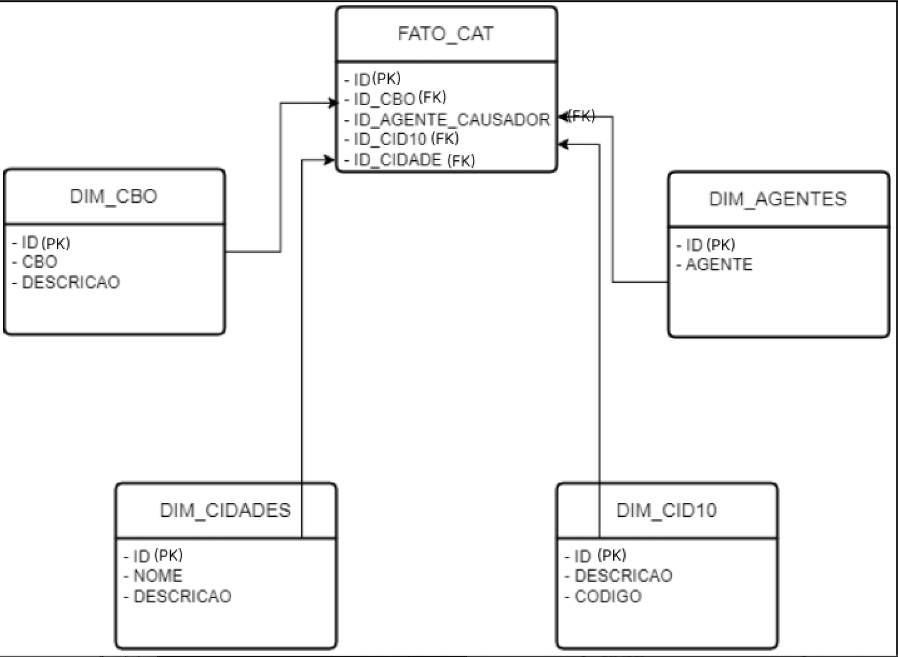

# 3. PLANEJAMENTO & DEFINIÇÕES

Nesta versão inicial do documento, buscamos vislumbrar possíveis necessidades e requisitos do trabalho a ser realizado. Tais definições, como por exemplo ferramentas a serem utilizadas, podem sofrer alterações até o fim deste projeto piloto, para então se consolidarem como modelo para os próximos. 

## 3.1. Ciclo de vida dos dados

Durante todo o ciclo de vida dos dados, serão três os principais papéis envolvidos na manutenção do projeto:

- **Data Owner/ Project Owner**: Ponto focal do projeto, proprietário dos dados e responsável por autorizações de acesso.
- **Data Engineer/ Data Steward**: Responsável pela qualidade e integridade dos dados na camada de análise.
- **Data Scientist/Analyst**: Utiliza os dados para análise e modelagem, com atenção aos requisitos dos usuários finais.

A arquitetura e o fluxo de dados são pensados a partir dos conceitos da pirâmide DIKW da seguinte forma:

### 3.1.1. Coleta

“D” da pirâmide DIKW; dados. Principais envolvidos: Data Owner, Data Enginner. Principal objetivo: garantir ingestão de dados monitorada acompanhando integridade da fonte.  

Serão utilizados os dados dos acidentes de trabalho no Brasil (CATS), disponibilizados no portal (dados.gov.br). Os dados são disponibilizados trimestralmente. A coleta e tratamento serão executadas na mesma periodicidade. Estes são disponibilizados em formatos CSV, XML e JSON a partir do ano de 2018. Como formato padrão de coleta será utilizado preferencialmente o CSV, por conter melhor apresentação e facilidade de compreensão já no arquivo bruto. 

Os scripts de extração devem ser escritos em Python. O desenvolvimento dos scripts pode ser realizado em notebooks da Google Colab. Uma vez finalizados, devem ser organizados em pastas e diretórios de acordo com funcionalidade e subidos ao repositório. 

### 3.1.2. Transformação e armazenamento

“I” da pirâmide DIKW; informação. Principais envolvidos:  Data Enginner, Data Scientist. Principais objetivos: Garantir que os dados armazenados tenham qualidade e modelagem adequada para uso com rastreabilidade de alterações.  

Além das transformações típicas de tratamento de dados, deve-se atentar que seja feita a remoção de ocorrências duplicadas: CAT em que o agente causador, indicador de óbito, natureza da lesão e parte atingida, são iguais, mantendo assim um único registro e reaproveitando o ID da ocorrência. Realizar também a adição da descrição completa do CID (Código Internacional de Doença) e CBO (Código Brasileiro de Ocupação). 

Os scripts de transformação também devem ser escritos em Python. Os dados devem ser armazenados em padrão estruturado, isto é, voltados para Data Warehousing, de forma que a análise de BI também seja possibilitada. Após tratamento, os dados devem estar em arquivos de CSV (utf-8), salvos em pastas e diretórios devidos, assim como em banco de dados MySQL. 

A tabela 1 apresenta o dicionário de dados do que se espera como conteúdo final dos arquivos. 

## Tabela 1 - Dicionário de Dados

| Campo/Coluna                 | Tipo               | Descrição                                                         |
|------------------------------|--------------------|-------------------------------------------------------------------|
| Agente Causador do acidente  | VARCHAR (120)      | Descrição e código do agente causador do acidente.                |
| Data Acidente                | DATE               | Data do Acidente de Trabalho registrada na CAT.                   |
| CBO                          | INTEGER            | Código Brasileiro de Ocupação.                                    |
| CID                          | VARCHAR (5)        | Identificador da doença de acordo com o CID-10 - Código Internacional de Doenças. |
| CNAE                         | VARCHAR (10)       | Classificação Nacional da Atividade Econômica no AEPS.            |
| Emitente da CAT              | VARCHAR (120)      | Emitente da CAT.                                                  |
| Espécie do Benefício         | VARCHAR (120)      | Espécie do Benefício.                                             |
| Filiação do Segurado         | VARCHAR (120)      | Tipo de filiação à Previdência Social do Segurado da CAT.         |
| Indicador de Óbito Acidente  | BOOLEAN            | Indicador de óbito do segurado.                                   |
| Município Empregador         | VARCHAR (120)      | Município do Empregador.                                          |
| Natureza da Lesão            | VARCHAR (120)      | Descrição e código da Natureza da Lesão do Segurado.               |
| Parte do Corpo Atingida      | VARCHAR (120)      | Parte do Corpo Atingida.                                          |
| Sexo                         | VARCHAR (1)        | Sexo do segurado informado na CAT.                                |
| Tipo de acidente             | VARCHAR (20)       | Tipo do Acidente de Trabalho sofrido pelo segurado.               |
| UF Município do Acidente     | VARCHAR (120)      | Unidade da Federação do local do acidente.                        |
| UF Município Empregador      | VARCHAR (120)      | Código da Unidade da Federação do Município do Empregador.        |
| Data Afastamento             | DATE               | Data em que ocorreu o afastamento do segurado do seu trabalho devido ao acidente de trabalho. |
| Data DDB                     | DATE               | Data do Despacho do Benefício.                                    |
| Data Nascimento              | DATE               | Data do nascimento do segurado.                                   |
| Data Emissão da CAT          | DATE               | Data de emissão da CAT.                                           |

Fonte: Autores 2024.

#  Uma prévia do modelo de Entidade-Relacionamento é mostrada na Figura 1 (DER)

Fonte: Autores, 2024

### 3.1.3. Desenvolvimento do Modelo

“K” da pirâmide DIKW; conhecimento. Principais envolvidos:  Data Scientist. Principais objetivos: Garantir desenvolvimento de modelo de Machine Learning com objetivos claros, em constante contato com a área de negócio. 

Nesta fase é verificada a aplicabilidade do modelo, sendo feita uma prova de conceito (POC). Diversos algoritmos são testados para validar de forma inicial a qualidade do modelo. Com os dados tratados, é possível realizar análises e interpretações buscando entender padrões. Nessa fase, é onde será implementado o modelo de aprendizagem de máquina (ML). 

Provas de Conceito e protótipos podem ser criados e testados usando Notebooks do Google Colab. Para facilitar exploração interativa dos dados e a experimentação com diferentes algoritmos. O desenvolvimento também deve ser em Python com bibliotecas de ML scikit-learn, TensorFlow ou PyTorch. 

### 3.1.4. Operacionalização

“W” da pirâmide DIKW; conhecimento. Principais envolvidos:  Data Scientist, Data Owner. Principais objetivos: Garantir entrega de um produto que gere confiança e valor, com segurança. 

Nessa fase, uma vez desenvolvido o modelo, é necessário disponibilizá-lo para uso/consumo, onde será os insights obtidos para a precificação dos seguros de vida. Para implantação do modelo, espera-se um modelo enxuto e rápido, podendo ser implantado como uma função serverless usando o AWS Lambda. 

## 3.2. Segurança

A extração e tratamento dos dados não adiciona informações internas à base de dados pública. Assim, não há riscos associados ao acesso de dados das fases de desenvolvimento anteriores ao aprendizado de máquina em si.  

O acesso ao repositório de códigos, entretanto, tanto da parte pública quanto da privada, deve ser bem controlado para garantir boa governança e que não ocorram perdas e erros internos no desenvolvimento. Backups devem ser realizados localmente e na nuvem. 

Quanto aos códigos e dados gerados por Machine Learning, por constituírem o produto de valor agregado que este projeto visa oferecer; estes devem ter acesso restrito a partir de papéis/funções (RBAC) atribuídas aos usuários internos, e seguirem o princípio do menor privilégio.

