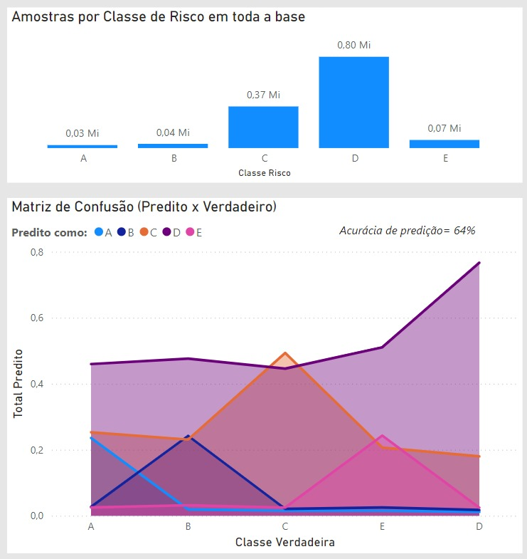

## 6. Otimização

A partir dos problemas encontrados no Item 4.3.3 (Árvore de Classificação), foi decidido optar pela otimização do mesmo.
Para isso, o metodo de pre-classificação foi refeito, para assim, utilizar os valores das classificações em categorias.
As categorias ficando divididas de 1 a 5, de acordo com o valor que anteriormente variavel de 0 a 1.

## 6.1. Árvore de Classificação
Para o treinamento do novo modelo, utilizamos o ONEHOTENCODER para encontrar os valores exclusivos (de 0 a 1) e categorizar de 1 a 5.
As colunas utilizadas foram Sexo, UF_Munic_Empregador, Ano_Nascimento, CNAE2_0_Empregador, CBO.

## 6.2. Pontuação de Acurácia e matriz de confusão
Após a primeira execução do modelo, foi possível obter os seguintes valores para as pontuações:

  
Figura 1 – Acurácia e matriz de confusão

  

    
  

  
Fonte: Autores, 2024

## 6.3. Resultado da classificação

  
Figura 2 – Arvore de classificação

  

    
  

  
Fonte: Autores, 2024

Na figura acima, foram utilizados os primeiros 100 registros da tabela ft_rank (tabela responsavel por armazenar os valores das classificações),
afim de se obter o resultado proximo das classificações anteriores.

## 6.4. Análise do resultado

  
Figura 3 – Amostras por Classe de Risco

  

    
  

  
Fonte: Autores, 2024

Ao analisar o resultado, por gráficos, vemos que o modelo tendeu a prever a maioria dos perfis como categoria D (gráfica da Matriz de Confusão). 
Isto que faz sentido, dado que a maioria dos acidentes que acontecem, e, logo, com os quais o modelo é treinado, são também desta categoria, como se vê no gráfico de barras.
Mesmo com a tendência de classificação para D, ao analisarmos as outras categorias, vemos que a distribuição de previsões segue o esperado.
Ou seja, de todas as predições para uma certa classe, a maioria foi realizada na classe verdadeira.
Levando em conta que acidentes de outras classes que não C e D são bem mais raros, ocorrendo proporcionalmente em muito menor frequência, julga-se aceitável que o modelo não os assuma com tanta frequência,
quando se leva em conta dados tão genéricos quanto sexo, ocupação, localidade. Com uma acurácia de previsão de classe de acidente de 64%, consideramos que atende-se também a aplicação objetivada do modelo,
o que levaria a uma avaliação de risco média menos variável - mais conservadora - para a maioria dos potenciais clientes do seguro, avaliando como altíssimo ou baixíssimo risco apenas perfis mais certeiros.
