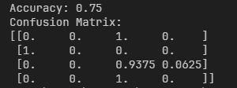
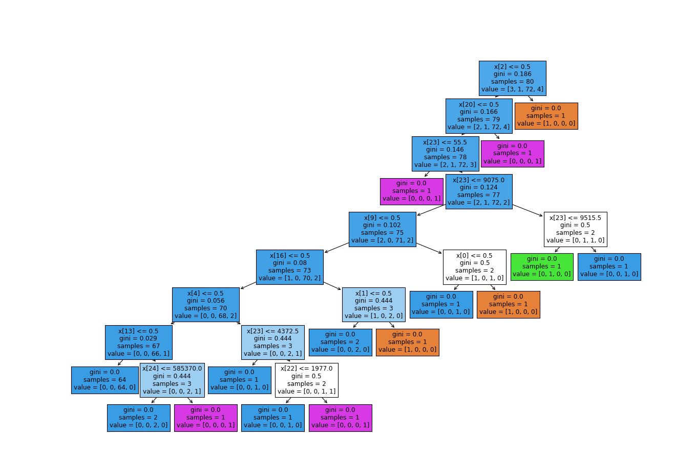

## 6. Otimização

A partir dos problemas encontrados no Item 4.3.3 (Árvore de Classificação), foi decidido optar pela otimização do mesmo.
Para isso, o metodo de pre-classificação foi refeito, para assim, utilizar os valores das classificações em categorias.
As categorias ficando divididas de 1 a 5, de acordo com o valor que anteriormente variavel de 0 a 1.

## 6.1. Árvore de Classificação
Para o treinamento e teste do modelo, foram utilizadas dois metodos para categorizar os valores das classificaçoes de risco:
  - LABEL ENCODER: transforma rótulos não numéricos em rótulos numéricos;
  - ONEHOTENCODER: encontro os valores exclusivos (de 0 a 1) e transforma os dados em uma codificação (categoria de 1 a 5).
As colunas utilizadas foram Sexo, UF_Munic_Empregador, Ano_Nascimento, CNAE2_0_Empregador, CBO.

## 6.2. Pontuação de Acurácia e matriz de confusão
Após a primeira execução do modelo, foi possível obter os seguintes valores para as pontuações:

  
Figura 1 – Acurácia e matriz de confusão

  

    
  

  
Fonte: Autores, 2024

## 6.3. Resultado da classificação

  
Figura 2 – Arvore de classificação

  

    
  

  
Fonte: Autores, 2024

Na figura acima, foram utilizados os primeiros 100 registros da tabela ft_rank (tabela responsavel por armazenar os valores das classificações),
afim de se obter o resultado proximo das classificações anteriores.
